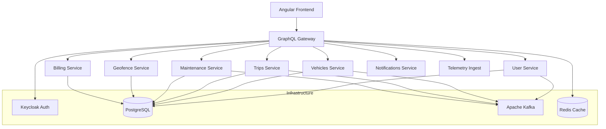

# 🚗 SmartStreet - Intelligent Fleet Management Platform

[](https://angular.io/)
[](https://spring.io/projects/spring-boot)
[](https://www.apollographql.com/docs/federation/)
[](https://www.keycloak.org/)
[](https://www.docker.com/)

A comprehensive fleet management platform built with modern microservices architecture, featuring real-time vehicle tracking, trip management, maintenance scheduling, and driver coordination.

## 📋 Table of Contents

- [🏗️ Architecture Overview](#️-architecture-overview)
- [✨ Features](#-features)
- [🛠️ Tech Stack](#️-tech-stack)
- [📦 Project Structure](#-project-structure)
- [🚀 Quick Start](#-quick-start)
- [🔧 Development Setup](#-development-setup)
- [📱 Frontend Application](#-frontend-application)
- [🔌 Backend Services](#-backend-services)
- [🔐 Authentication & Security](#-authentication--security)
- [🌐 API Documentation](#-api-documentation)
- [🧪 Testing](#-testing)
- [🚀 Deployment](#-deployment)
- [🤝 Contributing](#-contributing)
- [📄 License](#-license)

## 🏗️ Architecture Overview

SmartStreet follows a microservices architecture pattern with GraphQL Federation, providing scalable and maintainable fleet management solutions.



## ✨ Features

### 🚙 Fleet Management
- **Vehicle Registration & Management** - Complete vehicle lifecycle management
- **Real-time Vehicle Tracking** - GPS-based location tracking and monitoring
- **Vehicle Status Monitoring** - Active, inactive, and maintenance status tracking
- **Fleet Analytics** - Comprehensive fleet performance metrics

### 🗺️ Trip Management
- **Trip Planning & Scheduling** - Advanced trip creation and scheduling
- **Route Optimization** - Intelligent routing for maximum efficiency
- **Real-time Trip Tracking** - Live trip monitoring and updates
- **Trip History & Analytics** - Detailed trip reports and analytics

### 👥 Driver Management
- **Driver Profiles** - Complete driver information management
- **License & Certification Tracking** - Driver qualification management
- **Performance Monitoring** - Driver performance metrics and scoring
- **Assignment Management** - Efficient driver-vehicle assignments

### 🔧 Maintenance Management
- **Preventive Maintenance Scheduling** - Automated maintenance scheduling
- **Maintenance History Tracking** - Complete maintenance records
- **Cost Management** - Maintenance cost tracking and budgeting
- **Service Provider Management** - Vendor and technician management

### 💰 Billing & Finance
- **Trip-based Billing** - Automated billing based on trip data
- **Cost Tracking** - Comprehensive cost management
- **Invoice Generation** - Automated invoice creation
- **Financial Reporting** - Detailed financial analytics

### 🔔 Notifications & Alerts
- **Real-time Notifications** - Instant alerts for critical events
- **Maintenance Reminders** - Automated maintenance scheduling alerts
- **Trip Status Updates** - Real-time trip status notifications
- **Custom Alert Rules** - Configurable alert conditions

### 🗺️ Geofencing
- **Geographic Boundaries** - Define and manage geofenced areas
- **Entry/Exit Alerts** - Automated notifications for boundary crossings
- **Route Compliance** - Ensure vehicles stay within designated areas
- **Location-based Services** - Context-aware fleet management

## 🛠️ Tech Stack

### Frontend
- **Framework**: Angular 20.2 with Standalone Components
- **UI Library**: Angular Material Design
- **Styling**: SCSS with CSS Custom Properties
- **State Management**: NgRx Signals
- **GraphQL Client**: Apollo Angular
- **Internationalization**: ngx-translate
- **Authentication**: Keycloak JS Adapter

### Backend
- **Framework**: Spring Boot 3.5.4
- **Language**: Java 21
- **GraphQL**: DGS Framework with Federation
- **Database**: PostgreSQL 15
- **Message Broker**: Apache Kafka
- **Cache**: Redis 7
- **Authentication**: Keycloak 24.0.2

### Infrastructure
- **Containerization**: Docker & Docker Compose
- **API Gateway**: Apollo Router v2.6.0
- **Reverse Proxy**: Nginx
- **Build Tools**: Maven (Backend), Angular CLI (Frontend)

### Development Tools
- **Code Quality**: ESLint, Prettier
- **Testing**: Jasmine/Karma (Frontend), JUnit (Backend)
- **Code Generation**: GraphQL Codegen
- **IDE**: IntelliJ IDEA, VS Code

## 📦 Project Structure

```
SmartStreet/
├── 📱 SmartSFront/                    # Frontend Application
│   └── smart-street-app/
│       ├── src/
│       │   ├── app/
│       │   │   ├── core/              # Core services & guards
│       │   │   ├── features/          # Feature modules
│       │   │   │   ├── dashboard/     # Dashboard module
│       │   │   │   ├── vehicles/      # Vehicle management
│       │   │   │   ├── trips/         # Trip management
│       │   │   │   ├── drivers/       # Driver management
│       │   │   │   ├── maintenance/   # Maintenance module
│       │   │   │   ├── billing/       # Billing module
│       │   │   │   ├── geofences/     # Geofencing
│       │   │   │   └── notifications/ # Notifications
│       │   │   ├── shared/            # Shared components
│       │   │   └── layout/            # Layout components
│       │   ├── assets/                # Static assets
│       │   └── styles/                # Global styles
│       ├── package.json
│       └── angular.json
├── 🔧 Smart mobility/                  # Backend Services
│   ├── src/
│   │   ├── services/
│   │   │   ├── shared/                # Shared utilities
│   │   │   ├── api-gateway/           # GraphQL Gateway
│   │   │   ├── user-service/          # User management
│   │   │   ├── vehicles-service/      # Vehicle management
│   │   │   ├── trips-service/         # Trip management
│   │   │   ├── maintenance-service/   # Maintenance management
│   │   │   ├── geofence-service/      # Geofencing service
│   │   │   ├── billing-service/       # Billing service
│   │   │   ├── notifications-service/ # Notifications
│   │   │   └── telemetry-ingest/      # Telemetry processing
│   │   └── pom.xml
│   └── deploy/
│       ├── docker-compose.yml         # Development stack
│       └── ops/                       # Operations configs
├── 🎨 keycloak-theme/                 # Custom Keycloak Theme
│   ├── smartstreet/                   # Theme files
│   └── README.md
└── 📄 README.md                       # This file
```

## 🚀 Quick Start

### Prerequisites
- **Docker** & **Docker Compose** (for infrastructure)
- **Node.js** 18+ & **npm** (for frontend)
- **Java** 21 & **Maven** (for backend development)

### 1. Clone the Repository
```bash
git clone https://github.com/your-username/SmartStreet.git
cd SmartStreet
```

### 2. Start Infrastructure Services
```bash
cd "Smart mobility/deploy"
docker-compose up -d postgresql redis kafka zookeeper keycloak
```

### 3. Start Backend Services
```bash
cd "../src"
mvn clean install
mvn spring-boot:run
```

### 4. Start Frontend Application
```bash
cd "../../SmartSFront/smart-street-app"
npm install
npm start
```

### 5. Access Applications
- **Frontend**: http://localhost:4200
- **GraphQL Gateway**: http://localhost:4000/graphql
- **Keycloak Admin**: http://localhost:8083 (admin/admin)

## 🔧 Development Setup

### Backend Development

1. **Database Setup**
   ```bash
   # PostgreSQL will be automatically initialized with required schemas
   docker-compose up -d postgresql
   ```

2. **Message Broker Setup**
   ```bash
   # Start Kafka and Zookeeper
   docker-compose up -d kafka zookeeper
   ```

3. **Build & Run Services**
   ```bash
   cd "Smart mobility/src"
   mvn clean install
   
   # Start individual services
   cd services/user-service
   mvn spring-boot:run
   
   cd ../vehicles-service
   mvn spring-boot:run
   
   # ... repeat for other services
   ```

### Frontend Development

1. **Install Dependencies**
   ```bash
   cd SmartSFront/smart-street-app
   npm install
   ```

2. **Development Server**
   ```bash
   npm start
   # Runs on http://localhost:4200 with hot reload
   ```

3. **Code Generation**
   ```bash
   npm run codegen
   # Generates TypeScript types from GraphQL schema
   ```

4. **Code Quality**
   ```bash
   npm run lint        # Run ESLint
   npm run lint:fix    # Fix linting issues
   npm run format      # Format code with Prettier
   ```

## 📱 Frontend Application

### Technology Stack
- **Angular 20.2** with standalone components
- **Angular Material** for UI components
- **Apollo GraphQL** for data management
- **NgRx Signals** for state management
- **ngx-translate** for internationalization

### Key Features
- 🎨 **Modern Material Design** - Clean, responsive UI
- 🌍 **Multi-language Support** - English, French, Spanish, Arabic
- 📱 **Responsive Design** - Mobile-first approach
- ⚡ **Real-time Updates** - GraphQL subscriptions
- 🔐 **Role-based Access** - Keycloak integration
- 📊 **Interactive Dashboards** - Rich data visualizations

### Development Commands
```bash
# Development server
npm start

# Production build
npm run build:prod

# Run tests
npm test

# Code generation
npm run codegen

# Format code
npm run format
```

## 🔌 Backend Services

### Microservices Architecture

#### 👤 User Service
- User authentication and authorization
- Profile management
- Role-based access control

#### 🚗 Vehicles Service
- Vehicle registration and management
- Fleet monitoring and analytics
- Vehicle status tracking

#### 🗺️ Trips Service
- Trip planning and scheduling
- Route optimization
- Real-time tracking

#### 🔧 Maintenance Service
- Maintenance scheduling
- Service history tracking
- Cost management

#### 🏦 Billing Service
- Trip-based billing
- Invoice generation
- Financial reporting

#### 🔔 Notifications Service
- Real-time notifications
- Alert management
- Communication channels

#### 📍 Geofence Service
- Geographic boundary management
- Entry/exit monitoring
- Location-based rules

#### 📡 Telemetry Ingest
- Real-time data processing
- IoT device integration
- Data streaming

### GraphQL Federation
Services are federated through Apollo Router, providing a unified GraphQL API.

```graphql
# Example: Vehicle query with trips
query GetVehicleWithTrips($id: ID!) {
  vehicle(id: $id) {
    id
    make
    model
    licensePlate
    status
    trips {
      id
      status
      startTime
      endTime
    }
  }
}
```

## 🔐 Authentication & Security

### Keycloak Integration
- **Single Sign-On (SSO)** - Unified authentication across services
- **Role-Based Access Control** - Granular permissions
- **Multi-Factor Authentication** - Enhanced security
- **Custom Themes** - Branded login experience

### Security Features
- **JWT Tokens** - Secure API authentication
- **CORS Configuration** - Cross-origin resource sharing
- **Rate Limiting** - API abuse protection
- **Input Validation** - XSS and injection protection

## 🌐 API Documentation

### GraphQL Schema
The API is fully documented through GraphQL introspection. Access the GraphQL Playground at:
- **Development**: http://localhost:4000/graphql
- **Production**: https://api.smartstreet.com/graphql

### Key Endpoints

#### Vehicles
```graphql
# Get all vehicles
query GetVehicles {
  vehicles {
    id
    make
    model
    status
    licensePlate
  }
}

# Create vehicle
mutation CreateVehicle($input: CreateVehicleInput!) {
  createVehicle(input: $input) {
    id
    make
    model
  }
}
```

#### Trips
```graphql
# Get trip details
query GetTrip($id: ID!) {
  trip(id: $id) {
    id
    status
    startTime
    endTime
    vehicle {
      make
      model
    }
    driver {
      firstName
      lastName
    }
  }
}
```

## 🧪 Testing

### Frontend Testing
```bash
# Run unit tests
npm test

# Run tests with coverage
npm run test:coverage

# Run e2e tests
npm run e2e
```

### Backend Testing
```bash
# Run all tests
mvn test

# Run tests for specific service
cd services/vehicles-service
mvn test

# Integration tests
mvn verify
```

## 🚀 Deployment

### Docker Deployment
```bash
# Build all services
cd "Smart mobility/deploy"
docker-compose build

# Deploy full stack
docker-compose up -d

# Scale services
docker-compose up -d --scale vehicles-service=3
```

### Environment Configuration
Create environment-specific configuration files:

```yaml
# production.yml
version: '3.8'
services:
  postgresql:
    environment:
      POSTGRES_PASSWORD: ${DB_PASSWORD}
  keycloak:
    environment:
      KEYCLOAK_ADMIN_PASSWORD: ${KEYCLOAK_PASSWORD}
```

### Health Checks
All services include health check endpoints:
- **Health**: `/actuator/health`
- **Metrics**: `/actuator/metrics`
- **Info**: `/actuator/info`

## 🤝 Contributing

### Development Workflow
1. **Fork** the repository
2. **Create** a feature branch (`git checkout -b feature/amazing-feature`)
3. **Commit** changes (`git commit -m 'Add amazing feature'`)
4. **Push** to branch (`git push origin feature/amazing-feature`)
5. **Open** a Pull Request

### Code Standards
- **Frontend**: ESLint + Prettier configuration
- **Backend**: Google Java Style Guide
- **Commits**: Conventional commit format
- **Documentation**: Update README for new features

### Pull Request Guidelines
- ✅ All tests passing
- ✅ Code coverage maintained
- ✅ Documentation updated
- ✅ Breaking changes documented

## 📊 Monitoring & Analytics

### Application Monitoring
- **Prometheus** metrics collection
- **Grafana** dashboards
- **Spring Boot Actuator** health endpoints
- **GraphQL** query performance tracking

### Business Analytics
- **Fleet utilization** metrics
- **Trip completion** rates
- **Maintenance cost** analysis
- **Driver performance** scoring

## 🔧 Troubleshooting

### Common Issues

#### Frontend Issues
```bash
# Clear node modules and reinstall
rm -rf node_modules package-lock.json
npm install

# Clear Angular cache
ng cache clean
```

#### Backend Issues
```bash
# Clean and rebuild
mvn clean install

# Reset database
docker-compose down -v
docker-compose up -d postgresql
```

#### Infrastructure Issues
```bash
# Restart all services
docker-compose restart

# View service logs
docker-compose logs -f [service-name]
```

## 📄 License

This project is licensed under the MIT License - see the [LICENSE](LICENSE) file for details.

## 🙋‍♂️ Support

### Documentation
- **API Docs**: Available in GraphQL Playground
- **Architecture**: See `/docs` folder
- **Deployment Guide**: See deployment section above

### Community
- **Issues**: GitHub Issues for bug reports
- **Discussions**: GitHub Discussions for questions
- **Contributing**: See contributing guidelines above

### Contact
- **Email**: support@smartstreet.com
- **Website**: https://smartstreet.com
- **Documentation**: https://docs.smartstreet.com

---

<div align="center">
  <p>Built with ❤️ by the SmartStreet Team</p>
  <p>
    <a href="#smartstreet---intelligent-fleet-management-platform">⬆️ Back to Top</a>
  </p>
</div>